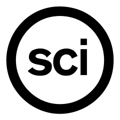

# Open Science Uppsala

> The Open Science logo, from [Wikimedia](https://commons.wikimedia.org/wiki/File:Openscience.svg)

Website for people that want to know/do more about/in Open Science in Uppsala.

Open Science is the application of the scientific method in the most transparent way possible, resulting in research that is (more likely to be) reproducible.

The scientific method has brought us many great discoveries. However, in more recent years, the Reproducibility Crisis started in the fields of Psychology and Sociology. It turned out that statistical significant findings in highly-cited papers turned out to be irreproducible. It turns out that scientists widely use the many degrees of freedom in their research to get to a significant result with a nice fitting story. Both p-value hacking and HARKing (Hypothesis After Results are Known) are dubious research practices that lead to irreproducible results, yet are commonly accepted practices.

Open Science helps scientists an alternative way to pursue knowledge in a reproducible way. The Registered Report a good illustration of the Open Science thought process: one writes down the research (i.e. the methods and analysis) and let it be reviewed before having collected the data. After passing such a (Stage I) review, a journal agrees to let one do his/her experiment, where the paper will be published regardless of the result.

This group discusses Open Science by means of discussing papers and inviting speakers. As part of Open Science is being 'open to engagement of social actors', these meetings themselves should be public. 

At the moment, the community is small. 

Please contact [@richelbilderbeek](https://github.com/richelbilderbeek)
at `richel@richelbilderbeek.nl` to help build it up.

## Activities

When                  | Where  |What
----------------------|--------|----------------
2023-01-13 16:00-17:00|USB [1] |[Discuss general paper]
2023-02-10 16:00-17:00|USB [1] |[Speaker 1]
2023-03-14 16:00-17:00|USB [1] |[Discuss paper]
2023-04-13 16:00-17:00|USB [1] |[Speaker 2]
2023-05-12 16:00-17:00|USB [1] |[Discuss paper]
2023-06-09 16:00-17:00|USB [1] |[Speaker 3]

 * USB: [Uppsala Stadsbibliotek](https://bibliotekuppsala.se/web/arena/stadsbiblioteket), Svartbäcksgatan 17, 753 75 Uppsala

## FAQ

These are the Frequently Asked Questions, also called 'FAQ'.

The sections are:

Section                                      |Description
---------------------------------------------|-------------------
[Open Science](#open-science)                |About Open Science
[Open Science Uppsala](#open-science-uppsala)|About us
[Website](#website)                          |About this website
[Volunteering](#volunteering)                |Volunteering at OSU
[Contact](#contact)                          |How to contact us

### Open Science

#### What is Open Science?

Open Science is a different thing for different people. A attempt of a definition that could be given: 

> Open Science is using the scientific method, 
> taking into account that scientists are human.

This means:

 * Open Access: everyone should be able to read and criticize scientistic works
 * Open Data: everyone should be able to re-use scientific data used in
   experiments, with some limitations on privacy-sensitive data
 * Open Code: everyone should be able to re-do, criticise and re-use scientific analyses
 * Open Hardware: everyone should be able to run a computational analysis
   on hardware accessible by  * Pre-registration: scientists should be open about their initial hypotheses
   and should not pursuaded to do p-value hacking or HARKing
 * Registered Reports: after reviewing the methods of a scientific experiment,
   its results -including a null finding- should be published

A more extensive picture:

> Redrawn slide from presentation of Ana Persic, 
> Division of Science Policy and Capacity-Building (SC/PCB), 
> UNESCO (France) presentation to Open Science Conference 2021, 
> ZBW — Leibniz Information Centre for Economics, Germany.
> Caption and image from [Wikipedia](https://en.wikipedia.org/wiki/Open_science#/media/File:Osc2021-unesco-open-science-no-gray.png),
> image created by [RobbieIanMorrison](https://commons.wikimedia.org/wiki/User:RobbieIanMorrison)

#### Which literature do you recommend?

 * [Search Google Scholar for 'Open Science'](https://scholar.google.com/scholar?hl=sv&as_sdt=0%2C5&q=open+science&btnG=)
 * See [the references](#references)

### Open Science Uppsala

#### What is the goal of Open Science Uppsala?

 * to teach one another about Open Science (e.g. by reading papers)
 * using English as the main language (i.e. most academic papers are English)
 * regularily (e.g. once a month)
 * for everyone (i.e. non-scientists are also welcome)
 * in Uppsala (i.e. in-person meetings)
 * for free (i.e. everyone can afford to participate)
 * at a public location (i.e. non-scientists can reach the venue)
 * in a scholarly way (i.e. we embrace the scientific method in our discussions)

#### What activities does Open Science Uppsala organize?

Currently none. 

Expected activities are:

 * Discussing Open Science papers
 * Speakers that discuss an aspect of Open Science

Please contact [@richelbilderbeek](https://github.com/richelbilderbeek)
at `richel@richelbilderbeek.nl` 
if you want to organize or participate in activities.

#### Why is Open Science Uppsala at the Stadsbibliotek? Why not at the university?

Because the meetings are intended to be open to everyone
that wants to discuss the scientific method in general
and Open Science in particular.

#### What will not be accepted in discussions?

 * *Ad hominem* reasoning: instead, discuss the content of the argument instead
 * Conspiracy theories (e.g. 'All scientists are corrupt'): instead,
   discuss what the academic literature states on scientists' behavior
 * Anecdotal evidence: instead, refer to scientific studies
   and/or reviews. Of course, throwing in a personal story is OK, 
   using it as a irrefutable proof is scholarly no-go.

#### Which similar communities are there in Uppsala?

 * ReproducibiliTea Psychology: a community that focuses on 
   the department of Psychology. They do not have a website.

Please add your Open Science community in Uppsala by 
Contact [@richelbilderbeek](https://github.com/richelbilderbeek)
at `richel@richelbilderbeek.nl` 
and I will happily add your Uppsala community here :-)

#### Which similar communities are there online?

There are many, here I list communities that have members in Uppsala:

 * [FAIRPoints](https://www.fairpoints.org/): an online 
   event series highlighting pragmatic measures 
   developed by the community 
   towards the implementation of the FAIR data principles.
 * [Open life Science](https://openlifesci.org/): 
   a program for people interested in applying open principles 
   in their work and becoming Open Science ambassadors in their communities.

### Website

#### Why did you start this website?

As the Open Science community in Uppsala is small.
At the time this website was created, it was the first website.

#### What is the goal of this website?

To connect people that are interesting in learning more about Open Science.

### Volunteering

#### What is the current structure of Open Science Uppsala?

 * Chairman: Richel
 * Communication: Richel
 * Organizing activities: Richel
 * Finances: Richel
 * Maintaining this website: Richel

#### Who are the team members?

 * Richel: [OSF](https://osf.io/5dtem/) [ORCID](https://orcid.org/0000-0003-1107-7049) [GitHub](https://github.com/richelbilderbeek) [Twitter](https://twitter.com/rjcbilderbeek)

#### I want to help organize! Am I welcome?

Yes, everyone is welcome.

#### I want to help organize! How does the team work?

The volunteers determine what Open Science Uppsala is,
hence voting is democratic:
most votes win.
All votes are equal.
For bigger change, the chair can request a two-third majority vote.

#### I want to help organize! What can I do?

Awesome!

You can:

 * to see what needs to be done: 
   visit the [Issues](https://github.com/richelbilderbeek/open_science_uppsala/issues) 
 * other things: contact [@richelbilderbeek](https://github.com/richelbilderbeek)
   at `richel@richelbilderbeek.nl` 

### Contact

#### How do I contact Open Science Uppsala

 * Send an email to [@richelbilderbeek](https://github.com/richelbilderbeek) at `richel@richelbilderbeek.nl`
 * Add a GitHub Issue

## References

 * [Kathawalla et al., 2021] Kathawalla, Ummul-Kiram, Priya Silverstein, and Moin Syed. "Easing into open science: A guide for graduate students and their advisors." Collabra: Psychology 7.1 (2021).

 * [Milham and Klein, 2019] Milham, Michael P., and Arno Klein. "Be the change you seek in science." BMC biology 17.1 (2019): 1-4.
   [List of recommended practices](https://matter.childmind.org/open-science.html)
  
