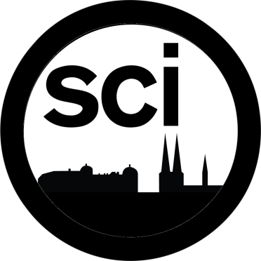

> The Open Science Uppsala logo

Welcome to the homepage of Open Science Uppsala,
the local Open Science community in Uppsala.

Open Science is the application of the scientific method 
in the most transparent way possible, 
such as Open Access papers, Open (and FAIR) Data,
Open Code, open peer-review, preregistration and registered reports,
resulting in research that is (more likely to be) reproducible.

This group discusses the pros and cons of Open Science 
by means of discussing papers and inviting speakers. 

You can follow us here:

Logo                                                |Link
----------------------------------------------------|---------------------------------------------------------
 | **[Email list](https://www.freelists.org/list/osu)**
               | **[LinkedIn](https://www.linkedin.com/groups/9261540/)**
      | **[@opensciupp](https://twitter.com/opensciupp)**
    | **[Facebook](https://www.facebook.com/profile.php?id=100090996055053)**

## Next activity

## Activities

We usually have a speaker at the second Friday of the month. 

When                      | Where              |What
--------------------------|--------------------|-----------------------------------------------------------------------------------------------------------------
2024-10-**18** 16:15-17:00|USB [1], Studion    |[Christopher Erdmann and Elin Kronander, Open science at SciLifeLab - the infrastructure unit's role in advancing open science in Sweden and beyond](events/20241011_christopher_erdmann_and_elin_kronander/README.md)
2024-11-08 16:15-17:00    |USB [1], Studion    |[Richel Bilderbeek, Open Science and humans being scientists](events/20241108_richel_bilderbeek/README.md)
2024-12-13 16:15-17:00    |USB [1], Studion    |Ismail Elouafiq, TBA
?2025-01-10               |?USB                |TBA
?2025-02-14               |?USB                |TBA
?2025-03-14               |?USB                |TBA
?2025-04-11               |?USB                |TBA
?2025-05-09               |?USB                |TBA
?2025-06-13               |?USB                |TBA
?2025-07-11               |?USB                |TBA

See ['events'](events/README.md) for our past activities.

- [1] USB: [Uppsala Stadsbibliotek](https://bibliotekuppsala.se/web/arena/stadsbiblioteket), 
  Svartbäcksgatan 17, 753 75 Uppsala

> Map, from [OpenStreetMap](https://www.openstreetmap.org/way/98942846).
> We are at 1.
> 1. Uppsala Stadsbibliotek, Svartbäcksgatan 17
> 2. Domkyrkan
> 3. Stora torget
> 4. Uppsala Central Station

> The ground floor of Uppsala Stadsbibliotek. We are in the room called 'Studion'

## Open Science Uppsala in the news

- [2023-10-06: article for the Uppsala University newsletter](https://www.uu.se/en/news/archive/2023-10-06-open-science-uppsala-reveals-science)
- [2023-12-11: interview with Universitetsläraren](https://universitetslararen.se/2023/12/11/samtalar-med-allmanheten-om-oppen-vetenskap/)

## Schedule

This is a regular schedule for a meeting. 
Note that the speaker is boss regarding (1) the exact time to start, 
(2) the time to yes/no take questions.

When         |What
-------------|-----------------------------------------------------------
15:30-16:00  |Speaker and OSU host prepare
16:00-16:15  |Audience is welcome
16:15-16:16  |Introduction about OSU
16:16-16:45  |Talk
16:45-17:00  |Questions
17:00 onwards|End of meeting, option to join us to the pub after cleaning

## FAQ

These are the Frequently Asked Questions, also called 'FAQ'.

The sections are:

Section                                               |Description
------------------------------------------------------|-------------------
[Open Science](#open-science)                         |About Open Science
[Open Science Uppsala](#open-science-uppsala)         |About us
[Website](#website)                                   |About this website
[Information for speakers](#information-for-speakers) |Information for speakers
[Volunteering](#volunteering)                         |Volunteering at OSU
[Contact](#contact)                                   |How to contact us

### Open Science

#### What is Open Science?

Open Science is a different thing for different people. A attempt of a definition that could be given: 

> Open Science is using the scientific method, 
> taking into account that scientists are human.

This means:

- Open Access: everyone should be able to read and criticize scientistic works
- Open Data: everyone should be able to re-use scientific data used in
   experiments, with some limitations on privacy-sensitive data
- Open Code: everyone should be able to re-do, criticise and re-use scientific analyses
- Open Hardware: everyone should be able to run a computational analysis
   on hardware with an open license
- Pre-registration: scientists should be open about their initial hypotheses
   and should not pursuaded to do p-value hacking or HARKing
- Preregistration: publishing the methods of a scientific experiment
   before doing the actual experiment
- Registered Reports: an more stringent extension of a preregistration,
   which, after reviewing the methods of a scientific experiment,
   its results are published, regardless of the results

A more extensive picture:

> Redrawn slide from presentation of Ana Persic, 
> Division of Science Policy and Capacity-Building (SC/PCB), 
> UNESCO (France) presentation to Open Science Conference 2021, 
> ZBW — Leibniz Information Centre for Economics, Germany.
> Caption and image from [Wikipedia](https://en.wikipedia.org/wiki/Open_science#/media/File:Osc2021-unesco-open-science-no-gray.png),
> image created by [RobbieIanMorrison](https://commons.wikimedia.org/wiki/User:RobbieIanMorrison)

#### Which literature do you recommend?

- [Search Google Scholar for 'Open Science'](https://scholar.google.com/scholar?hl=sv&as_sdt=0%2C5&q=open+science&btnG=)
- See [the references](#references)

### Open Science Uppsala

#### What is the goal of Open Science Uppsala?

- to **teach** one another about Open Science (e.g. by reading papers)
- to **discuss** Open Science
- using **English** as the main language (i.e. most academic papers are English)
- **regularily** (e.g. once a month)
- for **everyone** (i.e. non-scientists are also welcome)
- in **Uppsala** (i.e. in-person meetings)
- for **free** (i.e. everyone can afford to participate)
- at a **public location** (i.e. non-scientists can reach the venue)
- in a **scholarly** way (i.e. we embrace the scientific method in our discussions)

#### What activities does Open Science Uppsala organize?

Activities by OSU are, among others:

- Discussing Open Science papers
- Speakers that discuss an aspect of Open Science

See 'Activities' :-)

Please contact [@richelbilderbeek](https://github.com/richelbilderbeek)
at `rjcbilderbeek@gmail.com` 
if you want to organize or participate in activities.

#### How can I follow Open Science Uppsala?

You can follow us by:

-  **[Email list](https://www.freelists.org/list/osu)**
-  **[LinkedIn](https://www.linkedin.com/groups/9261540/)**
-  **[@opensciupp](https://twitter.com/opensciupp)**
-  **[Facebook](https://www.facebook.com/profile.php?id=100090996055053)**
- Mastodon: [TODO by Börje]

#### Why is Open Science Uppsala at the Stadsbibliotek? Why not at the university?

Because the meetings are intended to be open to everyone
that wants to discuss the scientific method in general
and Open Science in particular.

#### What will not be accepted in discussions?

- *Ad hominem* reasoning: instead, discuss the content of the argument instead
- Conspiracy theories (e.g. 'All scientists are corrupt'): instead,
  discuss what the academic literature states on scientists' behavior
- Anecdotal evidence: instead, refer to scientific studies
  and/or reviews. Of course, throwing in a personal story is OK, 
  using it as a irrefutable proof is scholarly no-go.

#### Which similar communities are there in Uppsala?

- [Science Fika](https://www.sciencefika.se):
  an community for 20 mins science talks aimed at a general audience
- ReproducibiliTea Psychology: a community that focuses on 
  the department of Psychology. They do not have a website.
- [The Uppsala node of the Swedish Reproducibility Network](http://www.swern.org/):
  a community that focuses reproducibility.
  This local node does not have had events yet.

Please add your Open Science community in Uppsala by 
Contact [@richelbilderbeek](https://github.com/richelbilderbeek)
at `rjcbilderbeek@gmail.com` 
and I will happily add your Uppsala community here :-)

#### Which similar communities are there online?

There are many, here I list communities that have members in Uppsala:

- [European Open Science Cloud Association](https://eosc.eu/),
  the bigger, more online community
- [Open Science Sweden](https://opensciencesweden.org/):
  the bigger, more online community
- [FAIRPoints](https://www.fairpoints.org/): an online 
  event series highlighting pragmatic measures 
  developed by the community 
  towards the implementation of the FAIR data principles.
- [Open life Science](https://openlifesci.org/): 
  a program for people interested in applying open principles 
  in their work and becoming Open Science ambassadors in their communities.

Contact [@richelbilderbeek](https://github.com/richelbilderbeek)
at `rjcbilderbeek@gmail.com` 
and I will happily add your online community here :-)

#### How many people visit each event?

See [the 'data' section](data/README.md), where you can find all data.

### Website

#### Why did you start this website?

As the Open Science community in Uppsala is small.
At the time this website was created, it was the first website.

#### What is the goal of this website?

To connect people that are interesting in learning more about Open Science.

### Email list

#### What is policy of the email list?

- Sent at the first day of each month, for months that have an activity
- Short

See [the newsletter archive](publicity/newsletter_archive.md) for previous newsletters.

### Twitter

#### What is the Twitter policy?

- Sent at the first day of each month, for months that have an activity
- Short

See [the tweets archive](publicity/tweets.md) for previous tweets.

### Information for speakers

#### What can I do?

You are boss here.

Here are some suggestions:

- Give a talk about your own Open Science work/ideas
- Discuss an Open Science scholarly article

#### What is the schedule?

Half an hour before the meeting, you'll have the time to prepare.
The first 15 minutes, the audience comes in.
Then you have 45 minutes left, that you can fill in yourself.
For example, you can do 30 minutes of talking and 15 minutes of questions.

Note that you are boss here. If you want more/less time for questions, 
it will be so :-)

#### What are the technical properties of the room?

- HDMI cable with a lot of converter plugs
- A big screen

### Volunteering

#### Who are the team members?

Ordered alphabetically on first name:

- Anna Hallberg 
  
  [0000-0001-6219-1402](https://orcid.org/0000-0001-6219-1402)
  
  [@AnnaHallberg3](https://twitter.com/AnnaHallberg3)
- Börje Dahrén
  
  [0000-0002-9274-6998](https://orcid.org/0000-0002-9274-6998)
  
  [@BDahren](https://twitter.com/BDahren)
- Jonas Söderberg
  
  [0000-0003-2722-7590](https://orcid.org/0000-0003-2722-7590)
   
  [Netzach](https://github.com/Netzach)
- Richel Bilderbeek: 
  
  [0000-0003-1107-7049](https://orcid.org/0000-0003-1107-7049) 
  
  [@rjcbilderbeek](https://twitter.com/rjcbilderbeek)
   
  [richelbilderbeek](https://github.com/richelbilderbeek) 
   
  [Richel Bilderbeek](https://osf.io/5dtem/) 

#### What is the current structure of Open Science Uppsala?

- Chairman: Richel
- Communication in/out: Richel
- Communication to NBIS and Life Science: Jonas
- Organizing activities: Richel
- Finances: Richel
- Maintaining this website: Richel
- Facebook account: Anna
- LinkedIn account: ?
- Mastodon account: Börje
- Twitter account: Richel

#### Who are the reserve team members?

Yup, we even have a reserve team. Here they are!

Ordered alphabetically on first name:

- Adam Gill
  
  [0000-0001-5641-610X](https://orcid.org/0000-0001-5641-610X)

#### Who are former team members?

Sometimes other things are even more important :-)

- Emmi Puuvuori
  
  [0000-0001-8501-218X](https://orcid.org/0000-0001-8501-218X)

#### I want to help organize! Am I welcome?

Yes, everyone is welcome.

#### I want to help organize! How does the team work?

The volunteers determine what Open Science Uppsala is,
hence voting is democratic:
most votes win.
All votes are equal.
For bigger change, the chair can request a two-third majority vote.

#### I want to help organize! What can I do?

Awesome!

You can:

- to see what needs to be done: 
  visit the [Issues](https://github.com/richelbilderbeek/open_science_uppsala/issues) 
- other things: contact [@richelbilderbeek](https://github.com/richelbilderbeek)
  at `rjcbilderbeek@gmail.com` 

### Contact

#### How do I contact Open Science Uppsala

- Send an email to [@richelbilderbeek](https://github.com/richelbilderbeek) at `rjcbilderbeek@gmail.com`
- Add a GitHub Issue

## Links

- [Uppsala university library page on Open Science](https://www.uu.se/en/library/publish/open-science)
- [SOPS4RI](https://sops4ri.eu/) ('Standard Operating Procedures for Research Integrity')
- [Open Science Radio](https://www.openscienceradio.org)
- [https://bit.ly/open_science_uppsala](https://bit.ly/open_science_uppsala): shorter link to homepage
- [https://github.com/open-science-uppsala/open_science_uppsala](https://github.com/open-science-uppsala/open_science_uppsala): GitHub page
- [CODECHECK](https://codecheck.org.uk/): tests if a computational experiment can be reproduced
- [ReproHack](https://www.reprohack.org/): tests if an academic paper can be reproduced
- [rOpenSci](https://ropensci.org/): public peer-review of R packages

> QR code to Open Science Uppsala homepage

## References

- [Kathawalla et al., 2021] 
  Kathawalla, Ummul-Kiram, Priya Silverstein, and Moin Syed. 
  "Easing into open science: A guide for graduate students and their advisors."
  Collabra: Psychology 7.1 (2021).

- [Milham and Klein, 2019] Milham, 
  Michael P., and Arno Klein. 
  "Be the change you seek in science." 
  BMC biology 17.1 (2019): 1-4.
  [List of recommended practices](https://matter.childmind.org/open-science.html)
