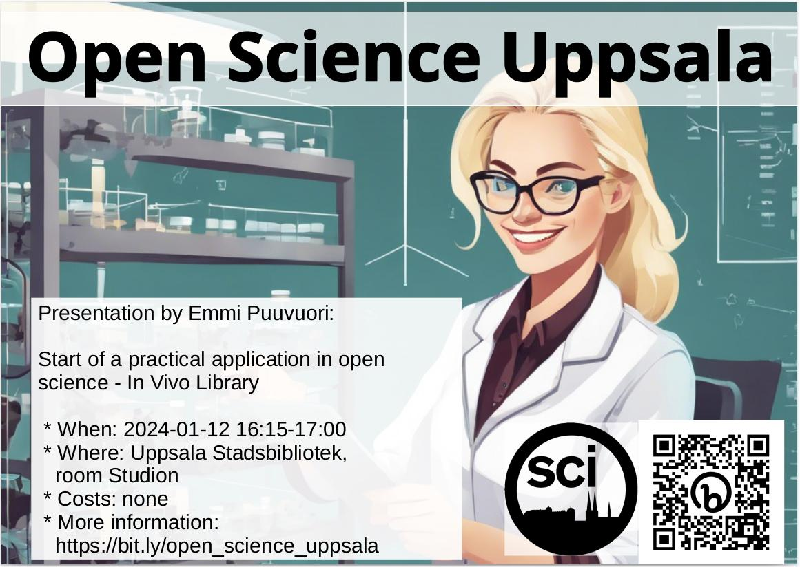

# 2024-01-12 Emmi Puuvuori: 'Start of a practical application in open science - In Vivo Library'

## USB

* Studion
* Språk: Engelska
* Ålder/Målgrupp: 8-88
* Samarrangör: Open Science Uppsala
* Anmälan: nej
* Bild av ansikte: -
* Fotografens namn av ansikte: -
* Bakgrundsbild: [background_image_2x.png](background_image_2x.png)
* Fotografens namn av bakgrundsbild: ingen, bild är [CC0](https://en.wikipedia.org/wiki/Creative_Commons_license#Zero_/_public_domain)

### Kort text

Fredag 12 januari 16.15-17.00 OSU hälsar Emmi Puuvuori
med föredrag 'Start of a practical application in open science - In Vivo Library'.
Fler info på <https://bit.ly/osc_uppsala>

### Längre text

Fredag 12 januari 16.15-17.00 hälsar Open Science Uppsala
Emmi Puuvuori
med föredrag 'Start of a practical application in open science - In Vivo Library'.

Open Science Uppsala är den lokala Open Science grupp,
var man diskuterar om -duh!- Open Science.
Open Science är en väg att forskning med -bland annat-
mål att göra forskning mer reproducerbar.
Var föredragare pratar om en aspekt av Open Science, oft
illustrerad med exempel av hans/hons egen interesse.

Varje en som omfamnar den vetenskaplig metod är välkommen
om att berömma och kritiserar Open Science.

Fler info på <https://bit.ly/osc_uppsala>
