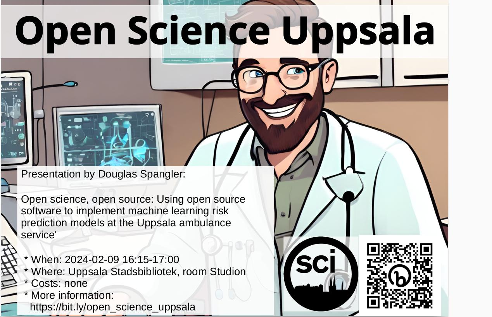

# 2024-02-09 Douglas Spangler: 'Open science, open source: Using open source software to implement machine learning risk prediction models at the Uppsala ambulance service'

## USB

* Studion
* Språk: Engelska
* Ålder/Målgrupp: 8-88
* Samarrangör: Open Science Uppsala
* Anmälan: nej
* Bild av ansikte: -
* Fotografens namn av ansikte: -
* Bakgrundsbild: [background_image.png](background_image.png)
* Fotografens namn av bakgrundsbild: ingen, bild är [CC0](https://en.wikipedia.org/wiki/Creative_Commons_license#Zero_/_public_domain)

### :sweden: Kort text

Fredag 9 februari 16.15-17.00 OSU hälsar Douglas Spangler
med föredrag 'Open science, open source: Using open source software to implement machine learning risk prediction models at the Uppsala ambulance service'.
Fler info på <https://bit.ly/osc_uppsala>

### :gb: Short text

Friday 9 February 2023 16:15-17:00, OSU welcomes Douglas Spangler
with his presentation 'Open science, open source: Using open source software to implement machine learning risk prediction models at the Uppsala ambulance service'.
More info at <https://bit.ly/osc_uppsala>

### :sweden: Längre text

Fredag 9 februari 16.15-17.00 hälsar Open Science Uppsala
Douglas Spangler
med föredrag 'Open science, open source: Using open source software to implement machine learning risk prediction models at the Uppsala ambulance service'.

Precis som den öppna vetenskapsrörelsen förändrar hur vi forskar,
förändrar programvara med öppen källkod hur vi omsätter frukterna
av vår forskning i praktiken.
I det här föredraget kommer Douglas att diskutera hur forskning
om maskininlärning omvandlas till kliniska beslutsstödssystem med hjälp
av open source-verktyg baserade på R och Python vid Uppsala ambulanstjänst,
och den potential som detta tillvägagångssätt
har för att omvandla hur IT-system anskaffas
och upprätthålls i den offentliga sektorn i stort.

Open Science Uppsala är den lokala Open Science grupp,
var man diskuterar om -duh!- Open Science.
Open Science är en väg att forskning med -bland annat-
mål att göra forskning mer reproducerbar.
Var föredragare pratar om en aspekt av Open Science, oft
illustrerad med exempel av hans/hons egen interesse.

Varje en som omfamnar den vetenskaplig metod är välkommen
om att berömma och kritiserar Open Science.

Fler info på <https://bit.ly/osc_uppsala>

### :gb: Longer text

Friday 9 February 16.15-17.00 Open Science greets Uppsala
Douglas Spangler
with lecture 'Open science, open source: Using open source software to implement machine learning risk prediction models at the Uppsala ambulance service'.

Just as the open science movement is changing how we do research,
open source software is changing
how we put the fruits of our research into practice.
In this talk, Douglas will discuss how machine learning research
is transformed into clinical decision support systems
using open-source tools based on R and Python at the Uppsala ambulance service,
and the potential that this approach has to transform how IT-systems
are procured and maintained in the public sector at large.

Open Science Uppsala is the local Open Science group,
where one discusses about -duh!- Open Science.
Open Science is a way to research with -among other things-
goal of making research more reproducible.
Each presenter talks about an aspect of Open Science, often
illustrated with examples of his/her own interest.

Anyone who embraces the scientific method is welcome
on praising and criticizing Open Science.

More info at <https://bit.ly/osc_uppsala>
