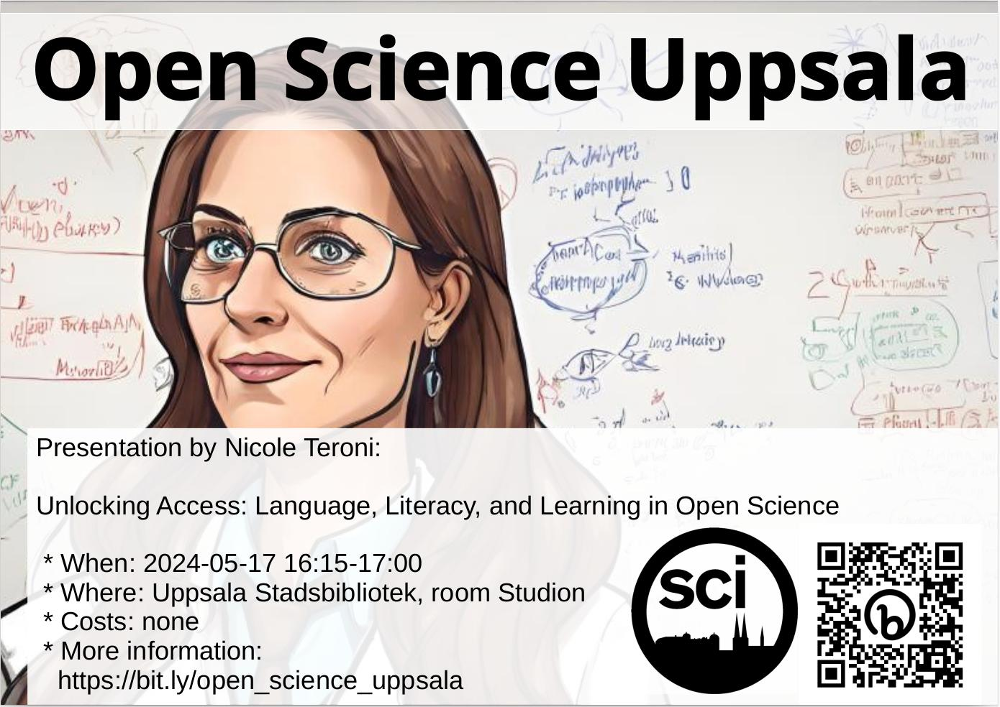

# 2024-06-14 Nicole Teroni, 'Unlocking Access: Language, Literacy, and Learning in Open Science'

* [Facebook event](https://fb.me/e/blcUoGz76)

## USB

* Studion
* Språk: Engelska
* Ålder/Målgrupp: 8-88
* Samarrangör: Open Science Uppsala
* Anmälan: nej
* Bild av ansikte: -
* Fotografens namn av ansikte: -
* Fotografens namn av bakgrundsbild: ingen, bild är [CC0](https://en.wikipedia.org/wiki/Creative_Commons_license#Zero_/_public_domain)

### :sweden: Kort text

Fredag 14 juni 16.15-17.00 OSU hälsar Nicole Teroni
med föredrag 'Unlocking Access: Language, Literacy, and Learning in Open Science'.
Fler info på <https://bit.ly/osc_uppsala>

### :gb: Short text

Friday 14th June 2023 16:15-17:00, OSU welcomes Nicole Teroni
with her presentation 'Unlocking Access: Language, Literacy, and Learning in Open Science'.
More info at <https://bit.ly/osc_uppsala>

### :sweden: Längre text

Fredag 14 juni 16.15-17.00 hälsar Open Science Uppsala
Nicole Teroni
med föredrag 'Unlocking Access: Language, Literacy, and Learning in Open Science'.

'Unlocking Access' utforskar de väsentliga komponenterna
för att göra Open Science verkligt inkluderande och effektfullt.
I en tid där kunskapsspridning alltmer digitaliseras,
står behärskning av språk, digital läskunnighet och kritiskt tänkande
som portvakter för att få tillgång till vetenskaplig kunskap.
Ur en pedagogs och språkspecialists perspektiv undersöker
detta föredrag vikten av språkkunskaper
och utbildning för att effektivt använda öppna vetenskapliga resurser.
Är det möjligt att främja ett rättvisare och informerat samhälle
genom att överbrygga tillgänglighet och expertis?

Open Science Uppsala är den lokala Open Science grupp,
var man diskuterar om -duh!- Open Science.
Open Science är en väg att forskning med -bland annat-
mål att göra forskning mer reproducerbar.
Var föredragare pratar om en aspekt av Open Science, oft
illustrerad med exempel av hans/hons egen interesse.

Varje en som omfamnar den vetenskaplig metod är välkommen
om att berömma och kritiserar Open Science.

Fler info på <https://bit.ly/osc_uppsala>

### :gb: Longer text

Friday 14 June 16.15-17.00 Open Science greets Uppsala
Nicole Teroni
with lecture 'Unlocking Access: Language, Literacy, and Learning in Open Science'.

'Unlocking Access' explores the essential components for making Open Science truly inclusive and impactful. In an era where knowledge dissemination is increasingly digitalised, mastery of language, digital literacy, and critical thinking skills stand as gatekeepers to accessing scientific knowledge. From the perspective of an educator and language specialist, this talk examines the importance of language proficiency and education on effectively utilizing open scientific resources. By bridging accessibility and expertise, is it possible to foster a fairer, informed society?

Open Science Uppsala is the local Open Science group,
where one discusses about -duh!- Open Science.
Open Science is a way to research with -among other things-
goal of making research more reproducible.
Each presenter talks about an aspect of Open Science, often
illustrated with examples of his/her own interest.

Anyone who embraces the scientific method is welcome
on praising and criticizing Open Science.

More info at <https://bit.ly/osc_uppsala>
