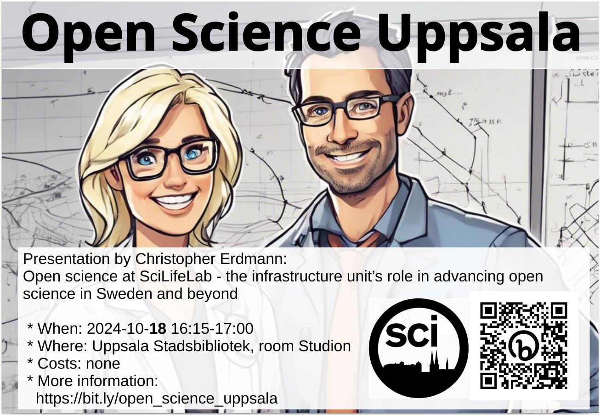

# 2024-10-18 Christopher Erdmann: 'Open science at SciLifeLab - the infrastructure unit’s role in advancing open science in Sweden and beyond'

* Title: Open science at SciLifeLab - the infrastructure unit’s role in advancing open science in Sweden and beyond
* Presenters: Christopher Erdmann
* [View presentation](presentation.pdf)

## Description

In the Government’s Research and Innovation Bill “Research, freedom, future – knowledge and innovation for Sweden” (prop. 2020/21:60), the government has called for a transition to a system of open science and states that data receiving public funding should be accessible, following the principle of being “as open as possible, as closed as necessary,” by 2026.
This session will provide a background with updates on current progress in this space while introducing interactive polling elements to help with the understanding of topics and the prioritisation of open science approaches.

