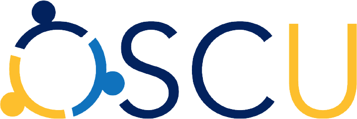

# Frequently asked questions

> The Open Science Community Uppsala logo

Welcome to the frequently asked questions of Open Science Community  Uppsala,
the local Open Science community in Uppsala.

The sections are:

Section                                                          |Description
-----------------------------------------------------------------|-------------------
[Open Science](#open-science)                                    |About Open Science
[Open Science Community Uppsala](#open-science-community-uppsala)|About us
[Other communities](#other-communities)                          |About other Open Science communities
[Website](#website)                                              |About this website
[Information for speakers](#information-for-speakers)            |Information for speakers
[Volunteering](#volunteering)                                    |Volunteering at OSCU
[Contact](#contact)                                              |How to contact us

## Open Science

### What is Open Science?

There are multiple definitions,
here is one from [the UNESCO Open Science toolkit](https://unesdoc.unesco.org/ark:/48223/pf0000387983.locale=en)

> Open science is a set of principles and practices that aim to make scientific
> research from all fields accessible to everyone for the benefits of
> scientists and society as a whole. For example, scientists and engineers can
> use open licenses to share their publications, data, software and hardware
> more widely—not only with each other but also with the rest of society.
> Open science is about making sure not only that scientific knowledge is
> accessible but also that the production of that knowledge itself is
> inclusive, equitable and sustainable.

### Which literature do you recommend?

- [Search Google Scholar for 'Open Science'](https://scholar.google.com/scholar?hl=sv&as_sdt=0%2C5&q=open+science&btnG=)

## Open Science Community Uppsala

### What is the goal of Open Science Community Uppsala?

- to **teach** one another about Open Science (e.g. by reading papers)
- to **discuss** Open Science
- using **English** as the main language (i.e. most academic papers are English)
- **regularily** (e.g. once a month)
- for **everyone** (i.e. non-scientists are also welcome)
- in **Uppsala** (i.e. in-person meetings)
- for **free** (i.e. everyone can afford to participate)
- at a **public location** (i.e. non-scientists can reach the venue)
- in a **scholarly** way (i.e. we embrace the scientific method in our discussions)

### What activities does Open Science Community Uppsala organize?

Activities by OSCU are, among others:

- Discussing Open Science papers
- Speakers that discuss an aspect of Open Science

See 'Activities' :-)

[Contact us](contact_us.md)
if you want to organize or participate in activities.

### Do I need to register for activities?

No.

You are always welcome :-)

### How can I follow Open Science Community Uppsala?

See [Follow us](follow.md) on how to follow us.

### Why is Open Science Community Uppsala at the Stadsbibliotek? Why not at the university?

Because the meetings are intended to be open to everyone
that wants to discuss the scientific method in general
and Open Science in particular.

### What will not be accepted in discussions?

- *Ad hominem* reasoning: instead, discuss the content of the argument instead
- Conspiracy theories (e.g. 'All scientists are corrupt'): instead,
  discuss what the academic literature states on scientists' behavior
- Anecdotal evidence: instead, refer to scientific studies
  and/or reviews. Of course, throwing in a personal story is OK,
  using it as a irrefutable proof is scholarly no-go.

### How many people visit each event?

See [the 'data' section](../data/README.md), where you can find all data.

## Other communities

### Which similar communities are there in Uppsala?

- [Science Fika](https://www.sciencefika.se):
  an community for 20 mins science talks aimed at a general audience
- ReproducibiliTea Psychology: a community that focuses on
  the department of Psychology. They do not have a website.
- [The Uppsala node of the Swedish Reproducibility Network](http://www.swern.org/):
  a community that focuses reproducibility.
  This local node does not have had events yet.

Please add your Open Science community in Uppsala by
[contacting us](contact_us.md)
and your Uppsala community will be added :-)

### Which similar communities are there outside of Uppsala?

There are many, here I list communities that have members in Uppsala:

- [International Network of Open Science & Scholarship Communities](https://osc-international.com/):
  the bigger, international community
- [Open Science Sweden](https://opensciencesweden.org/):
  the bigger, national community
- [European Open Science Cloud Association](https://eosc.eu/),
  the bigger, more online community
- [FAIRPoints](https://www.fairpoints.org/): an online
  event series highlighting pragmatic measures
  developed by the community
  towards the implementation of the FAIR data principles.
- [Open life Science](https://openlifesci.org/):
  a program for people interested in applying open principles
  in their work and becoming Open Science ambassadors in their communities.

[Contact us](contact_us.md) and your online community will be added :-)

## Website

### Why did you start this website?

As the Open Science community in Uppsala is small.
At the time this website was created, it was the first website.

### What is the goal of this website?

To connect people that are interesting in learning more about Open Science.

## Email list

### What is policy of the email list?

- Sent at the first day of each month, for months that have an activity
- Short

See [the newsletter archive](../publicity/newsletter_archive.md) for previous newsletters.

## Twitter

### What is the Twitter policy?

- Sent at the first day of each month, for months that have an activity
- Short

See [the tweets archive](../publicity/tweets.md) for previous tweets.

## Information for speakers

### What can I do?

You are boss here.

Here are some suggestions:

- Give a talk about your own Open Science work/ideas
- Discuss an Open Science scholarly article

### What is the schedule?

This is the schedule:

When         |What
-------------|-----------------------------------------------------------
15:30-15:45  |OSCU host prepares
15:45-16:00  |Speaker arrives, prepare technicalities
16:00-16:15  |Audience is welcome
16:15-16:16  |Introduction about OSCU
16:16-17:00  |Talk, including questions
17:00 onwards|End of meeting, option to join us to the pub after cleaning

During your talk, you are free to determine when there is time for
questions.

### What type of visitors can I expect?

People that are interested in Open Science.
Around two-thirds of the audience works in academia.

### How many visitors can I expect?

See [the 'data' section](../data/README.md), where you can find all data.

### What are the technical properties of the room?

- HDMI cable with a lot of converter plugs
- A big screen

## Volunteering

### Who are the team members?

Ordered alphabetically on first name:

- Anna Hallberg
  
  [0000-0001-6219-1402](https://orcid.org/0000-0001-6219-1402)
  
  [@AnnaHallberg3](https://twitter.com/AnnaHallberg3)
- Börje Dahrén
  
  [0000-0002-9274-6998](https://orcid.org/0000-0002-9274-6998)
  
  [@BDahren](https://twitter.com/BDahren)
- Jonas Söderberg
  
  [0000-0003-2722-7590](https://orcid.org/0000-0003-2722-7590)
  
  [Netzach](https://github.com/Netzach)
- Richel Bilderbeek:
  
  [0000-0003-1107-7049](https://orcid.org/0000-0003-1107-7049)
  
  [@rjcbilderbeek](https://twitter.com/rjcbilderbeek)
  
  [richelbilderbeek](https://github.com/richelbilderbeek)
  
  [Richel Bilderbeek](https://osf.io/5dtem/)

### What is the current structure of Open Science Community Uppsala?

- Chairman: Richel
- Communication in/out: Richel
- Communication to NBIS and Life Science: Jonas
- Organizing activities: Richel
- Finances: Richel
- Maintaining this website: Richel
- Facebook account: Anna
- LinkedIn account: ?
- Mastodon account: Börje
- Twitter account: Richel

### Who are the reserve team members?

Yup, we even have a reserve team. Here they are!

Ordered alphabetically on first name:

- Adam Gill
  
  [0000-0001-5641-610X](https://orcid.org/0000-0001-5641-610X)

### Who are former team members?

Sometimes other things are even more important :-)

- Emmi Puuvuori
  
  [0000-0001-8501-218X](https://orcid.org/0000-0001-8501-218X)

### I want to help organize! Am I welcome?

Yes, everyone is welcome.

### I want to help organize! How does the team work?

The volunteers determine what Open Science Community Uppsala is,
hence voting is democratic:
most votes win.
All votes are equal.
For bigger change, the chair can request a two-third majority vote.

### I want to help organize! What can I do?

Awesome!

You can:

- to see what needs to be done:
  visit the [Issues](https://github.com/richelbilderbeek/open_science_uppsala/issues)
- [Contact us](contact_us.md).

## Contact

### How do I contact Open Science Community Uppsala?

See [Contact us](contact_us.md).

## Links

- [Uppsala university library page on Open Science](https://www.uu.se/en/library/publish/open-science)
- [SOPS4RI](https://sops4ri.eu/) ('Standard Operating Procedures for Research Integrity')
- [Open Science Radio](https://www.openscienceradio.org)
- [https://bit.ly/open_science_uppsala](https://bit.ly/open_science_uppsala): shorter link to homepage
- [https://github.com/open-science-uppsala/open_science_uppsala](https://github.com/open-science-uppsala/open_science_uppsala): GitHub page
- [CODECHECK](https://codecheck.org.uk/): tests if a computational experiment can be reproduced
- [ReproHack](https://www.reprohack.org/): tests if an academic paper can be reproduced
- [rOpenSci](https://ropensci.org/): public peer-review of R packages

