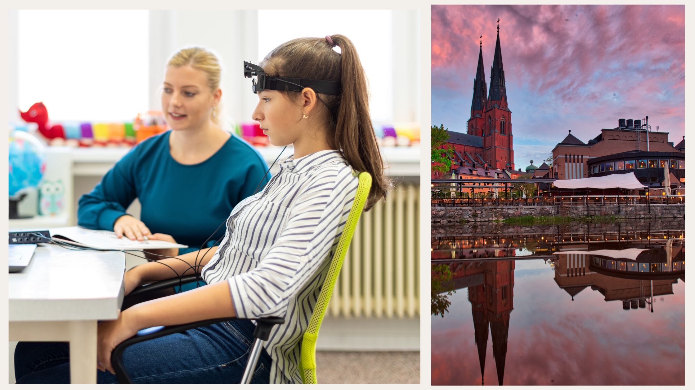

# 2023-10-20: Ismail Elouafiq


 * [Presentation (.pdf)](20231020_ismail.pdf)

## USB

 * Studion
 * Språk: Engelska
 * Ålder/Målgrupp: 8-88
 * Samarrangör: -
 * Anmälan: nej
 * Bild av ansikte: [https://github.com/open-science-uppsala/open_science_uppsala/blob/master/pics/ismail/open_science_ismail.png](https://github.com/open-science-uppsala/open_science_uppsala/blob/master/pics/ismail/open_science_ismail.png)
 * Fotografens namn av ansikte: obekant
 * Bakgrundsbild: [https://github.com/open-science-uppsala/open_science_uppsala/blob/master/pics/ismail/open_science_talk_citizenscience.png](https://github.com/open-science-uppsala/open_science_uppsala/blob/master/pics/ismail/open_science_talk_citizenscience.png)
 * Fotografens namn av bakgrundsbild: obekant

### Kort text

Lördag 20 oktober 16.15-17.00 OSU hälsar Ismail Elouafiq
med föredrag 'Experiment on yourself: open citizen science in Uppsala'.
Fler info på https://bit.ly/open_science_uppsala

### Längre text

Lördag 20 oktober 16.15-17.00 hälsar Open Science Uppsala
Ismail Elouafiq
med föredrag 'Experiment on yourself: open citizen science in Uppsala'.

Open Science Uppsala är den lokala Open Science grupp, 
var man diskuterar om -duh!- Open Science. 
Open Science är en väg att forskning med -bland annat- 
mål att göra forskning mer reproducerbar.
Var föredragare pratar om en aspekt av Open Science, oft
illustrerad med exempel av hans/hons egen interesse.

Varje en som omfamnar den vetenskaplig metod är välkommen
om att berömma och kritiserar Open Science.

Fler info på https://bit.ly/open_science_uppsala

## LinkedIn

```
This month we have the pleasure to have a presentation by Ismail Elouafiq, 'Experiment on yourself: open citizen science in Uppsala'. Afterwards we'll head to the pub to discuss more about open science. Hope to see you there!

When: Friday October 20th 16:15-17:00
Where: Uppsala Stadsbibliotek, Mallassal
```

## Facebook

```
This month we have the pleasure to have a presentation by Ismail Elouafiq, 'Experiment on yourself: open citizen science in Uppsala'. Afterwards we'll head to the pub to discuss more about open science. Hope to see you there!

When: Friday October 20th 16:15-17:00
Where: Uppsala Stadsbibliotek, Mallassal
```

## Twitter

```
OSU's next talk: Friday October 20th 16:15-17:00 at Stadsbiblioteket by Ismail Elouafiq, 'Experiment on yourself: open citizen science in Uppsala'. #OpenScienceTalks
```

## SLU screen text


 * [PDF](20231020_ismail_screens.pdf)
 * [ODF](20231020_ismail_screens.odg)

Presentation by Ismail Elouafiq:

Experiment on yourself: open citizen science in Uppsala

 * When: 2023-10-20 16:15-17:00
 * Where: Uppsala Stadsbibliotek, Mallassal
 * Costs: none
 * More information: https://bit.ly/open_science_uppsala

## Images by Ismail



