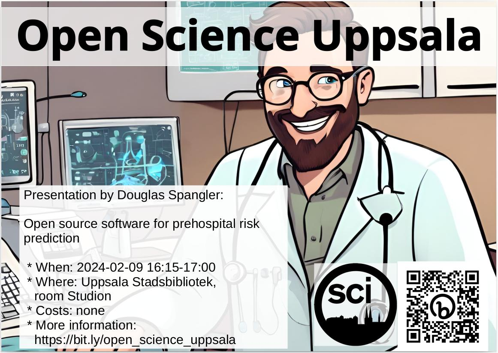

# 2024-02-09 Douglas Spangler, 'Open source software for prehospital risk prediction'

Title: 'Open source software for prehospital risk prediction'

## USB

 * Studion
 * Språk: Engelska
 * Ålder/Målgrupp: 8-88
 * Samarrangör: Open Science Uppsala
 * Anmälan: nej
 * Bild av ansikte: -
 * Fotografens namn av ansikte: -
 * Bakgrundsbild: [background_image.png](background_image.png)
 * Fotografens namn av bakgrundsbild: ingen, bild är [CC0](https://en.wikipedia.org/wiki/Creative_Commons_license#Zero_/_public_domain)

### Kort text

Lördag 9 februar 16.15-17.00 OSU hälsar Douglas Spangler
med föredrag 'Open source software for prehospital risk prediction'.
Fler info på https://bit.ly/open_science_uppsala

### Längre text

Lördag 9 februar 16.15-17.00 hälsar Open Science Uppsala
Douglas Spangler
med föredrag 'Open source software for prehospital risk prediction'.

Open Science Uppsala är den lokala Open Science grupp, 
var man diskuterar om -duh!- Open Science. 
Open Science är en väg att forskning med -bland annat- 
mål att göra forskning mer reproducerbar.
Var föredragare pratar om en aspekt av Open Science, oft
illustrerad med exempel av hans/hons egen interesse.

Varje en som omfamnar den vetenskaplig metod är välkommen
om att berömma och kritiserar Open Science.

Fler info på https://bit.ly/open_science_uppsala
